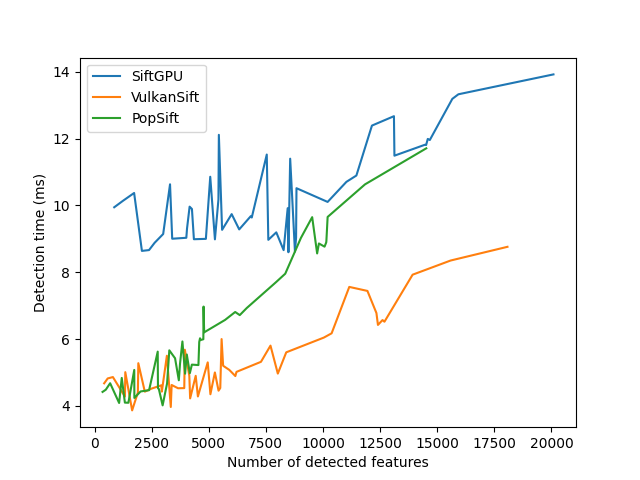

# Performances

VulkanSift performances are directly compared to the following SIFT implementations (GPU or CPU):
- [VLFeat](https://www.vlfeat.org/) (CPU): default configuration, version 0.9.21
- [SiftGPU](https://github.com/pitzer/SiftGPU) (GPU): with upsampling, CUDA enabled, commit b46bd5b8cc5cfdc1dc163444b72c705569800b6d
- [PopSift](https://github.com/alicevision/popsift) (GPU): default configuration with classic descriptor normalization, version 0.9
- [OpenCV](https://opencv.org/) (CPU): default configuration, version 4.2

All implementations are used in their specific wrapper file in [/src/perf/wrappers/](/src/perf/wrappers/) and are configured with the same options (upsampling, sigma value, thresholds).

## Detection speed tests

Detection speed measurements are performed on the ["Affine Covariant Features" dataset](https://www.robots.ox.ac.uk/~vgg/data/affine/) (Visual Geometry Group,Oxford University) and the [Hannover dataset](http://www.tnt.uni-hannover.de/project/feature_evaluation/). 

Even if the scale-space construction represents most of the runtime, the final runtime depends also on the number of features, especially if the number of detected features is high. The results are provided here to compare multiple implementations with a single test setup, they don't give a global estimate of the execution time.

All results were obtained running [perf_sift_runtime](../src/perf/perf_runtime.cpp) with a NVIDIA RTX 2060.

### Results with the Hannover dataset:

For each image, 10 warmup detections are performed followed by 100 measured detections. The mean of these detections is stored and used with measurements from other images to compute the mean execution time for a specific resolution.

| Resolution | VLFeat     | OpenCV    | SiftGPU  | PopSift  | VulkanSift |
| ---------- | ---------- | --------- | -------- | -------- | ---------- |
| 1536x1024  | 3034.82 ms | 203.86 ms | 28.24 ms | 23.00 ms | 16.47 ms   |
| 3456x2304  |            |           |          | 97.97 ms | 73.29 ms   |

<b>[2024.01.14] Updated results (NVIDIA RTX 4070 (laptop), Intel i7-13700HX)</b>

| Resolution | VLFeat     | OpenCV    | SiftGPU  | PopSift  | VulkanSift |
| ---------- | ---------- | --------- | -------- | -------- | ---------- |
| 1536x1024  | 2038.58 ms | 115.37 ms | 19.81 ms | 11.69 ms | 10.61 ms   |
| 3456x2304  |            |           |          | 52.97 ms | 46.04 ms   |

### Results with the Oxford dataset:

Images from the different image sets differ in resolution. In this test, all the images are resized to 640x480 before being used.

For each image, 10 warmup detections are performed followed by 100 measured detections. The mean of these detections are stored alongside with the number of detected features. The execution time measurements for GPU implementations is show in the graph below as a function of the number of detected features.

<b>[2024.01.14] Updated results (NVIDIA RTX 4070 (laptop), Intel i7-13700HX)</b>

## Feature quality tests

To evaluate the SIFT features quality, the repeatability, match ratio, matching score and precision metrics is computed on the ["Affine Covariant Features" dataset](https://www.robots.ox.ac.uk/~vgg/data/affine/) (Visual Geometry Group,Oxford University). Metrics are briefly described below and more in detail in "Comparative Evaluation of Binary Features" by Heinly, Dunn and Frahm.

Metrics:
- **Repeatability:** percentage of corresponding image regions detected (see "A Comparison of Affine Region Detectors" by K. Mikolajczyk). The OpenCV function `cv::evaluateFeatureDetector()` is used to get this value.
- **Match ratio:** ratio between the number of detected matches and the number of detected features in the first image.
- **Matching score:** ratio between the number of correct matches and the number of detected features in the first image.
- **Precision:** ratio between the number of correct matches and the number of detected matches.

For any implementation, matches are obtained using OpenCV's brute-force KNN matcher with 2 neighbors, followed by a ratio check on the neighbors distances (threshold set at 0.75).
A match is considered correct if the true matching point (obtained through the homography provided by the dataset) is at less than 2.5 pixels than the matched point.

Results are compared with other SIFT implementations in the graphs below:

## Build and use tests

Performance executables can be built with the library by enabling the CMake `VULKANSIFT_BUILD_PERFS` option. Other SIFT implementation (apart from OpenCV) must be built outside the project and manually added to the project files. Library and header files must be placed in the [external_libs/](/external_libs/) folder with the following hierarchy:
- VulkanSift/external_libs/
  - vlfeat/
    - lib/libvlfeat.a
    - src/
  - popsift/
    - lib/libpopsift.so
    - src/
  - SiftGPU/
    - lib/libsift_gpu.a
    - src/

When the *perf_sift_runtime* and *perf_sift_match* are built, they can be used with datasets specified in this page. 

*perf_sift_match* takes as a command line argument the path to a folder containing the extracted Oxford dataset folders (bark, boat, etc) as well as the name of the SIFT detector that will be used (if a second detector is specified, it will be used to detect features on the image 2 to 6 of each folder). This program saves results in a matching_results_DET_NAME.txt file in the current working directory, containing for each image pair the information and desired metrics. These files can be used with the [plot_matching_results.py](/scripts/plot_matching_results.py) script to generate plots using all available result files.

*perf_sift_runtime* takes an image path as a command line argument followed by the name of the SIFT detector to use. It produces an output file runtime_results_DET_NAME.txt containing the average detection time for the image and the number of detected features. For the results in this page it was used with the scripts [hannover_runtime_perf.py](/scripts/hannover_runtime_perf.py), [oxford_runtime_perf.py](/scripts/oxford_runtime_perf.py) and [plot_oxford_runtime_perf.py](/scripts/plot_oxford_runtime_perf.py) to generate the tables and plots.